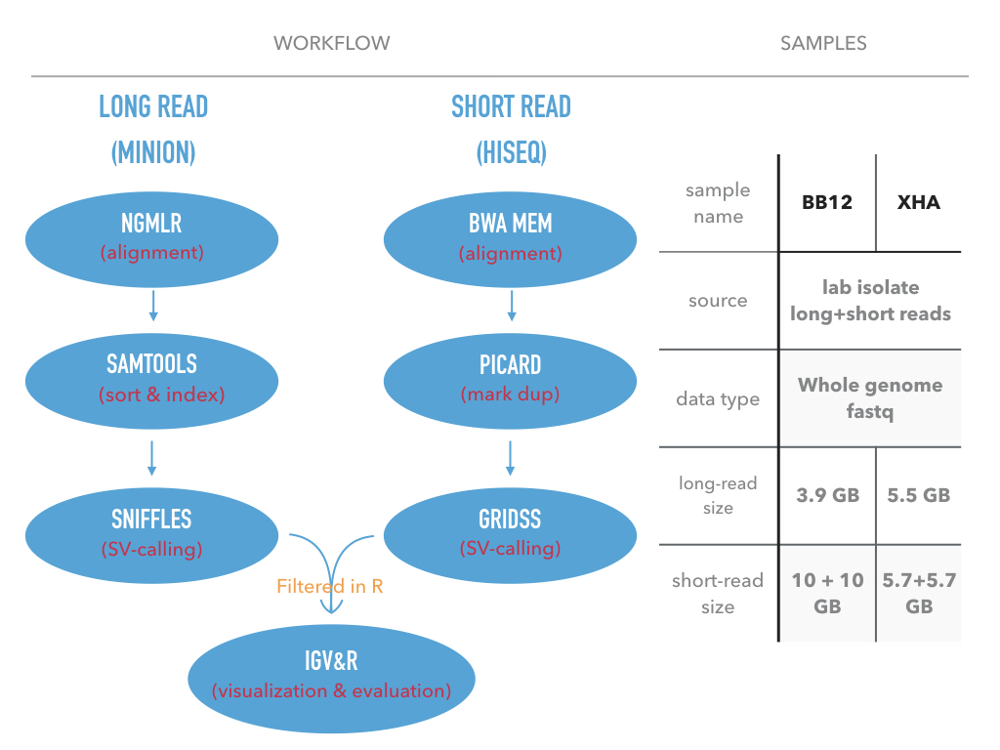
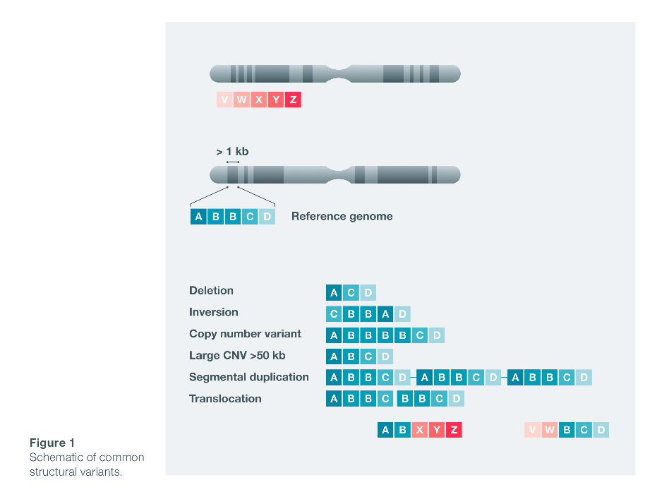

```{r setup0, include=FALSE}
knitr::opts_chunk$set(echo = TRUE)
```

<style>

table, td, th {
  border: none;
  padding-left: 1em;
  padding-right: 1em;
  min-width: 50%;
  margin-left: auto;
  margin-right: auto;
  margin-top: 1em;
  margin-bottom: 1em;
}

</style>


This is my work during my internship in Walter + Eliza Institute of Medical Research.  
In this document, I briefly introduce how to detect **structural variants (SVs)** from long-read data and validate those by short-reads.

The workflow and sample I use in this study:


# Structrual variants in BB12 and XHA


## What is structrual variants?

**Structural variation (SV)** refers to insertions, deletions, duplication, inversions,and translocations > 50 bp in length (Also includes large CNVs).


<br>

## Main contents 

The **structural variants (SV)** detection from **long-read** can give us more infomation than short-read. In this document, I use the SV detected from Plasmodium falciprum sample bb12. First, I overlap the SVs with nine popular genes. Second, I give some examples where long-read sequencing has advantages over short-read sequencing in terms of SV detection.

### Overlapping with genes 

SVs in genes related with drug resistance and anti-folate resistance

```{r gene_info_input, echo=FALSE}
gene_id <- c("PF3D7_0304600", "PF3D7_0417200", "PF3D7_0810800", "PF3D7_0731500", "PF3D7_1035300", "PF3D7_1343700", "PF3D7_1343700", "PF3D7_1343700", "PF3D7_1335900")
gene_name <- c("CSP", "DHFR", "DHPS", "EBA175", "GLURP", "K13", "MDR1", "MSP1", "TRAP")
gene_position <- c("Pf3D7_03_v3: 221,323 - 222,516(-)", "Pf3D7_04_v3: 748,088 - 749,914(+)", 
                   "Pf3D7_08_v3: 548,200 - 550,616(+)", "Pf3D7_07_v3:1,358,055 -1,362,929 (+)", 
                   "Pf3D7_10_v3:1,399,195 - 1,402,896 (+)", "Pf3D7_13_v3: 1,724,817 -1,726,997 (-)", "Pf3D7_05_v3: 957,890 - 962,149(+)", 
                   "Pf3D7_09_v3: 1,201,812 - 1,206,974 (+)", "Pf3D7_13_v3: 1,464,895 -1,466,619 (-)")
gene_function <- c("circumsporozoite protein", 
                   "Bifunctional dihydrofolate reductasethymidylate synthase", "Dihydropteroate synthetase", 
                   "erythrocyte bindingantigen-175", "glutamate-rich protein", "kelch protein K13", "multidrug resistanceprotein", 
                   "merozoite surface protein 1", "thrombospondin-related adhesion protein")
reference <- c("Weedall, G. D.,et al. (2007)", "Nwakanma, D.C. et al. (2014)", "Nwakanma, D.C. et al. (2014)", 
               "Baum, J et al.(2003)", "Conway, D.J.(1997)", "Miotto, O. et al(2013)", "Nwakanma, D.C. et al. (2014)", 
               "Tetteh, K. K. A.et al. (2009)", "Weedall, G. D.,et al. (2007)")
sv_type <- c("INS", "DEL", "DEL", "DEL + INS", "DEL", "DEL", "DUP", "NOISE", "DEL")
sv_location <- c("within gene", "upper stream","upper stream", "within gene", "within gene", 
                 "down stream", "cover all gene", "within gene", "within gene")
sv_length <- c("32,56,76","271","52", "694 + 350", "115+57+54", "33", "95kbp", "35kbp", "46 + 60")
sample <- c("bb21 + xha", "xha", "xha","xha","bb12 + xha", "bb12 + xha", "bb12", "bb12", "bb12 + xha")
gene_info_df <- data.frame(gene_id=gene_id, gene_name=gene_name, gene_position=gene_position, gene_function=gene_function,reference=reference,sv_type=sv_type,sv_location=sv_location,sv_length=sv_length,sample=sample)
gene_info_df
```

#### Links to IGV visualization:
[CSP](CSP_INS.png)  [DHFR](DHFR_DEL.png)  [DHPS](DHPS_DEL.png)  [EBA175](EBA175_DEL_INS.png)  [GLURP](GLURP_DEL.png)  [K13](K13_DEL.png)  [MDR1](MDR1_DUP.png)  [MSP1](MSP1_NOISE.png)  [TRAP](TRAP_DEL.png)

### Long-reads outperformance

```{r}
chrom <- c(01,02,09,13,13)
sv_position <- c(463927,822520, 1241724, 754419, 872046)
sv_type <- c("DEL","DEL","DEL","DEL","DEL")
sv_length <- c(279, 482, "unprecise","unknown", "unprecise")
sv_info_df <- data.frame(chrom=chrom, sv_position=sv_position, sv_type=sv_type, sv_length=sv_length)
sv_info_df
```

#### Links to above SV visalization:
[1](Pf3D7_01_v3-463,927_DEL.png)

[2]("Pf3D7_02_v3-822,520_DEL.png")

[3](Pf3D7_09_v3-1,241,724_DEL.png)

[4](Pf3D7_13_v3-754,419_DEL.png)  

[5](Pf3D7_13_v3-872,046-875,579_DEL_IGV.png)
