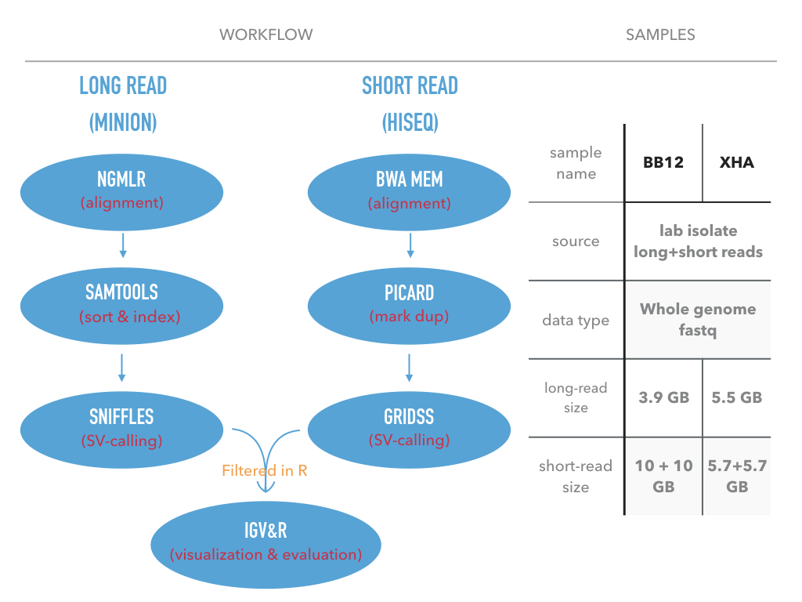
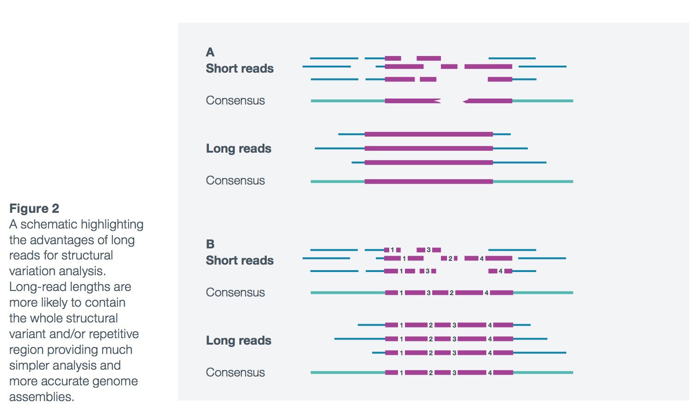
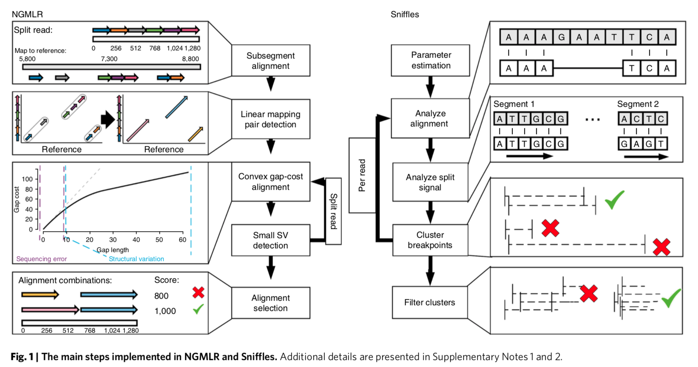
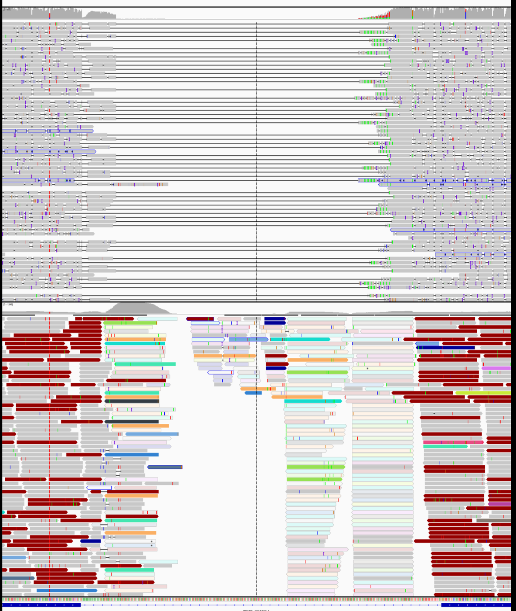
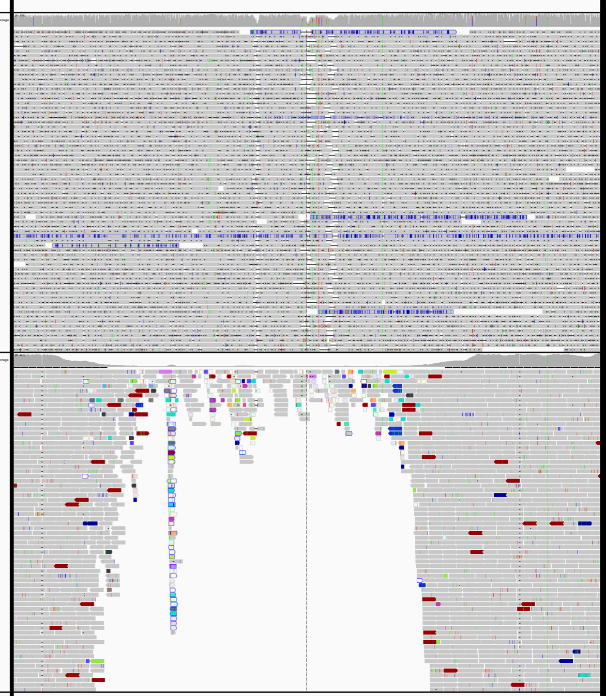

```{r setup0, include=FALSE}
knitr::opts_chunk$set(echo = TRUE)

# install.packages("stargazer")
# install.packages("RXKCD")

```

<style>

table, td, th {
  border: none;
  padding-left: 1em;
  padding-right: 1em;
  min-width: 50%;
  margin-left: auto;
  margin-right: auto;
  margin-top: 1em;
  margin-bottom: 1em;
}

</style>


This is my work during my internship in Walter + Eliza Institute of Medical Research.  
In this document, I briefly introduce how to detect **structural variants (SVs)** from long-read data and validate those by short-reads.

Structural variations are the greatest source of genetic variation, but they remain poorly understood because of technological limitations. Single-molecule long-read sequencing has the potential to dramatically advance the field, although high error rates are a challenge with existing methods.

Also, for complex structrual variants (cxSV), whole genome sequencing and short-read data allow us to make more confident decision in clinical investigation^1^. So, my study used  WGS data of Plasmodium falciparum from both long-read and short-read sequencing platform.  


 

## Current situation
Most high-throughput sequencing technologies require users to sequence short lengths of DNA (typically 150-300bp). Clearly, these short reads are less likely to span larger structural variation, making analysis particularly challenging, especially in repetitive genomic regions. Given that repetitive regions (such as centromeres, telomeres and other repetitive elements) encompass over half of the human genome10, this is a significant concern when mapping structural variants using short-read technology. As a consequence, most existing genome assemblies, which have been created using short reads, exhibit numerous gaps, corresponding to repetitive regions and structural variation that cannot be resolved^2^.
 

## Why long-read
These challenges are now being addressed by the emergence of long-read nanopore sequencing, which allows entire DNA fragments to be sequenced, regardless of their length. Users can choose to sequence long fragments of several kilobases to ultra-long reads with lengths currently approaching 1 Mb14. Such long reads are able to span most structural variation and repetitive regions simplifying their analysis (Figure 2). Long-read lengths are more likely to contain the whole structural variant and/or repetitive region providing much simpler analysis and more accurate genome assemblies^2^.

 
## Key info of Sniffles SV-callling 

### What is Sniffles
Sniffles^3^ is a SV-detection software developed for long-reads sequencing data. It provides high sensitivity and precision for variant detection, even in repeat-rich regions and for complex nested events.  
### What Sniffles does
- Detects indels, duplications, inversions, translocations, and nested events (Not found in my study)  
- Scanning the alignments of each read independently, then clustering the candidate SVs across all reads  
- Uses both within-alignment and split-read alignments paradigm 
- Genotyping and phasing of found SVs 
- Report adjacent or nested events in the VCF file  

### Requirement for Sniffles  
- Work best with NGMLR^4^ alignment results  
- Minimum read-coverage:  
&nbsp;&nbsp;&nbsp;&nbsp; 10X coverage using 10 kbp long-reads  
&nbsp;&nbsp;&nbsp;&nbsp; 25X coverage using 2*100 bp short-reads

### Options and their default value
+ Minimum read support (default: 10 reads)  
+ Minimum read length (default: 30 bp)
+ Maxium distance to group SV together (default: 1kb)

# Code & result{.tabset .tabset-fade .tabset-pills}  
In this document, I represent my work in two part

&nbsp;&nbsp;&nbsp;&nbsp; Bash code: The pipeline for alighnment and SV-calling for both long-reads and short-reads.  

&nbsp;&nbsp;&nbsp;&nbsp; R code: The scripts for information extraction, comparation, and smmarization from the output vcf file.

## Bash code  
*long_read.fastq -> SV.vcf*

### Sniffles pipeline 

#### ngmlr + Sniffles  
We use ngmlr for alignment and Sniffles for SV-calling (Figure 1).  


 
Pipeline:
```{bash eval=FALSE, include=TRUE}
# Reference: ${REF}*
# Query:     ${QRY}

REF=PlasmoDB-38_Pfalciparum3D7_Genome
QRY=bb12 # you can change it if you have a different sample
OUPUT="$HOME/ngm_sniff_output/"
module load anaconda3
source activate my_env

ngmlr -t 4 -r ${REF}.fasta \
	   -q ${QRY}.fastq \
	   -o ngm.sam \
	   -x ont

#Samtool for convert SAM to BAM and sort
samtools view -S -b ngm.sam > ngm.bam
samtools sort ngm.bam -o ngm.sorted.bam

#indexingthe sorted BAM file:
samtools index ngm.sorted.bam

#sniffles SVs_calling
sniffles -m ngm.sorted.bam -v sniffSV.vcf
```
*The fastq and fasta files can be found in this path:`/wehisan/general/academic/malaria_genomics`
 

#### SURVIVOR^5^    
*merge vcf files from multiple samples or callers*
 
First, we collect all files that we want to merge in a file.  
`ls *vcf > sample_file`

Next, we use SURVIVOR to obtain a call set.  
`./SURVIVOR merge sample_files 1000 2 1 1 0 30 sample_merged.vcf`  
This will merge all the vcf files specified in sample_files together using a maximum allowed distance of 1kb. Furthermore we ask SURVIVOR only to report calls supported by 2 callers and they have to agree on the type (1) and on the strand (1) of the SV. Note you can change this behavior by altering the numbers from 1 to e.g. 0. In addition, we told SURVIVOR to only compare SV that are at least 30bp long and print the output in sample_merged.vcf.

### GRIDSS pipeline

We can easily get comprehensive SV calling from short-read data with gridss^6^

```{bash eval=FALSE, echo=TRUE}
#!/bin/bash
#PBS -l nodes=1:ppn=14,mem=0gb,walltime=24:00:00
#PBS -N bwa_gridss
#PBS -o bwa_gridss_out
#PBS -e bwa_gridss_err

REF=PlasmoDB-38_Pfalciparum3D7_Genome.fasta
QRY=Illu-bb12-R

# load anaconda and activate my_env2:
module load anaconda3 bwa samtools R java
source activate my_env2

if [[ ! -f bwa_sorted_dupMarked.bam ]] ; then
	# samtools sort:
	#Samtool for convert SAM to BAM and sort
	bwa mem -t 14 $REF ${QRY}1.fastq ${QRY}2.fastq | \
	samtools sort - -o bwa_sorted.bam && \
	samtools index bwa_sorted.bam && \
	picard CollectAlignmentSummaryMetrics \
          R=$REF \
          I=bwa_sorted.bam \
          O=marked_dup_metrics.txt && \
	picard MarkDuplicates \
   	   I=bwa_sorted.bam \
   	   O=bwa_sorted_dupMarked.bam \
   	   M=marked_dup_metrics.txt
fi

GRIDSS_JAR=gridss-1.7.2-gridss-jar-with-dependencies.jar
java -ea -Xmx24g \
	-Dreference_fasta="$REF" \
	-Dsamjdk.create_index=true \
	-Dsamjdk.use_async_io_read_samtools=true \
	-Dsamjdk.use_async_io_write_samtools=true \
	-Dsamjdk.use_async_io_write_tribble=true \
	-Dgridss.gridss.output_to_temp_file=true \
	-cp $GRIDSS_JAR gridss.CallVariants \
	TMP_DIR=. \
	WORKING_DIR=. \
	REFERENCE_SEQUENCE="$REF" \
	INPUT="bwa_sorted_dupMarked.bam" \
	OUTPUT="$QRY.gridss.vcf" \
	ASSEMBLY="$QRY.gridss.assembly.bam" \
	WORKER_THREADS=14 \
	2>&1 | tee -a gridss.$HOSTNAME.$$.log

```
The fastq and fasta files can be found in this path:`/wehisan/general/academic/malaria_genomics`
 

## R code 

*SV.vcf -> R objects -> visualization*
 
### Extraction and summarization from vcf file
 
#### Read vcf file into R  

*and filter out obvious false-positives*

```{r echo=TRUE, message=FALSE, warning=FALSE}
# source("https://bioconductor.org/biocLite.R")
# biocLite("VariantAnnotation")

library(VariantAnnotation) # bioconductor, version 1.26.1
sniffles_vcf = readVcf("./sniffles_bb12.vcf", "pf3d7")
sniffles_vcf = sniffles_vcf[granges(sniffles_vcf)$FILTER == "PASS" 
                            & info(sniffles_vcf)$RE < 500 
                            & info(sniffles_vcf)$SVLEN < 99999]

# convert vcf object to data.frame object
sniffles_df = as.data.frame(info(sniffles_vcf))
```

 

#### Plot **SV types counts** and  **SV length ECDF**  
 *using packages: dplyr and pplot2*

```{r SV_type&SV_length, message=FALSE, warning=FALSE}
# install.packages("dplyr")
# install.packages("ggplot2")

library(dplyr) # version 0.7.6
library(ggplot2) # version 2.2.1

sniffles_df  %>%
  group_by(SVTYPE) %>%
  summarize(counts = n()) %>%
  ggplot(aes(x=SVTYPE, y=counts)) + geom_bar(colour="grey", fill="grey",stat = "identity")

sniffles_df %>%
  mutate(log10.SVLEN = log10(SVLEN)) %>%  
  ggplot(aes(log10.SVLEN)) +
  stat_ecdf(geom = "point", colour="grey") +
  labs(title="ecdf of log10(SVLEN)")
```

#### Extract other information

1.**support type (SUPTYPE)** counts

```{r SUPTYPE, message=FALSE, warning=FALSE}
sniffles_df %>%
  count(SUPTYPE) %>%
  ggplot(aes(x=SUPTYPE, y=n)) + geom_bar(colour="grey" , fill="grey", stat = "identity")
```

2. **support read (RE)** counts

```{r RE_plot, message=FALSE, warning=FALSE}
sniffles_df %>%
  ggplot(aes(x=RE)) +
  geom_histogram(binwidth = 10, colour="white", fill="grey") +
  geom_vline(aes(xintercept=mean(RE)), colour="red", linetype="dashed", size=1)
```

### SVs validation from short-read data

#### Convert vcf to gRange object
(gRange is an R object for genomic data)  
```{r gRange_conversion, message=FALSE, warning=FALSE}
# install.packages("stringr")
# install.packages("devtools")

library(stringr)
library(devtools)
install_github("PapenfussLab/StructuralVariantAnnotation")
library(StructuralVariantAnnotation)

# Read and filter gridss vcf (The QUAL>1000 threshold is recommended by GRIDSS)
gridss_vcf = readVcf("./gridss_bb12.vcf", "pf3d7")
gridss_vcf = gridss_vcf[granges(gridss_vcf)$QUAL>1000]
gridss_vcf = gridss_vcf[granges(gridss_vcf)$FILTER == "PASS"]

# Convert gridss_vcf to a gRange object
gridss_gr = breakpointRanges(gridss_vcf)
```

 

#### Annotate SVs
```{r annotate short-read, warning=FALSE}
# Simple SV type classifier
simpleEventType <- function(gr) {
  return(ifelse(seqnames(gr) != seqnames(partner(gr)), "ITX", # inter-chromosomosal
                ifelse(gr$insLen >= abs(gr$svLen) * 0.7, "INS", # TODO: improve classification of complex events
                       ifelse(strand(gr) == strand(partner(gr)), "INV",
                              ifelse(xor(start(gr) < start(partner(gr)), strand(gr) == "-"), "DEL",
                                     "DUP")))))
}

svtype <- simpleEventType(gridss_gr)
info(gridss_vcf)$SIMPLE_TYPE <- NA_character_
info(gridss_vcf[gridss_gr$vcfId])$SIMPLE_TYPE <- svtype
info(gridss_vcf[gridss_gr$vcfId])$SVLEN <- gridss_gr$svLen
```

 

#### Overlaps between short-read and long-read  
*according to the SV-TYPE*  
```{r overlap, warning=FALSE}
# Convert sniffles_vcf to a gRange object
sniffles_gr = breakpointRanges(sniffles_vcf)

hits = findBreakpointOverlaps(gridss_gr, sniffles_gr, maxgap=15)

# create a new column as a flag of overlapping
gridss_gr$match2sniffles = NA
gridss_gr[hits$queryHits]$match2sniffles = names(sniffles_gr)[hits$subjectHits]

sniffles_gr$match2gridss = 'no'
sniffles_gr[hits$subjectHits]$match2gridss = 'yes'
sniffles_gr$match2gridssID = NA
sniffles_gr[hits$subjectHits]$match2gridssID = names(gridss_gr)[hits$queryHits]
sniffles_gr$Counts = 1

# draw overlapping bar plot
sniffles_df <- data.frame(sniffles_gr)
sniffles_df %>%
  ggplot(aes(x=svtype, y=Counts, fill=match2gridss)) +
  geom_bar(stat = "identity")
```


## Long-read advantages

### Less noise in repetitive region

A deletion in BB12  



### False_deletion_correction

Another deletion in BB12  



## Conclusion & Reference

1. Sniffles can complete the SV calling of Plasmodium falciprum (from bam file) within two hours. 

2. Most SV callings from Sniffles are supported by ALN(alignment, also supported by read depth). 

3. With consideration of read depth, Sniffles detects high proportion of deletion compared to GRIDSS result. However, It does not detect much of other structural variants.

4. Sniffles's overlaps with GRIDSS only happen in deletion (other samples have few insertion). The reason is not clear. Also, Sniffles did not report any nested structural variants.

5. In terms of deletion and insertion. Long-read has clear advantages against short-read in terms of precision and number.

### Reference

1. Complex Structural Variants Resolved by Short-Read and Long-Read Whole Genome Sequencing in Mendelian Disorders
Alba Sanchis-Juan, Jonathan Stephens, Courtney E French, Nicholas Gleadall, Karyn Mégy, Christopher Penkett, Kathleen Stirrups, Isabelle Delon, Eleanor Dewhurst, Helen Dolling, Marie Erwood, Detelina Grozeva, Gavin Arno, Andrew R Webster, Trevor Cole, Topun Austin, Ricardo Garcia Branco, NIHR BioResource NIHR BioResource, Willem H Ouwehand, F Lucy Raymond, Keren J Carss
bioRxiv 281683; doi: https://doi.org/10.1101/281683
2. White paper: Nanopore sequencing The application and advantages of long-read nanopore sequencing to structural variation analysis, Oxford Nanopore Technologies.
3. Accurate detection of complex structural variations using single molecule sequencing
Fritz J Sedlazeck, Philipp Rescheneder, Moritz Smolka, Han Fang, Maria Nattestad, Arndt von Haeseler, Michael Schatz
bioRxiv 169557; doi: https://doi.org/10.1101/169557
4. Accurate detection of complex structural variations using single molecule sequencing
Fritz J Sedlazeck, Philipp Rescheneder, Moritz Smolka, Han Fang, Maria Nattestad, Arndt von Haeseler, Michael Schatz
bioRxiv 169557; doi: https://doi.org/10.1101/169557
Now published in Nature Methods doi: 10.1038/s41592-018-0001-7
5. Transient structural variations have strong effects on quantitative traits and reproductive isolation in fission yeast.
Jeffares, Daniel C; Jolly, Clemency; Hoti, Mimoza; Speed, Doug; Shaw, Liam; Rallis, Charalampos; Balloux, Francois; Dessimoz, Christophe; Bähler, Jürg; Sedlazeck, Fritz J.
Nature communications, Vol. 8, 14061, 24.01.2017, p. 1-11. DOI:10.1038/NCOMMS14061
6. GRIDSS: sensitive and specific genomic rearrangement detection using positional de Bruijn graph assembly. Cameron DL, Schröder J, Penington JS, et al. Genome Research. 2017;27(12):2050-2060. doi:10.1101/gr.222109.117.
